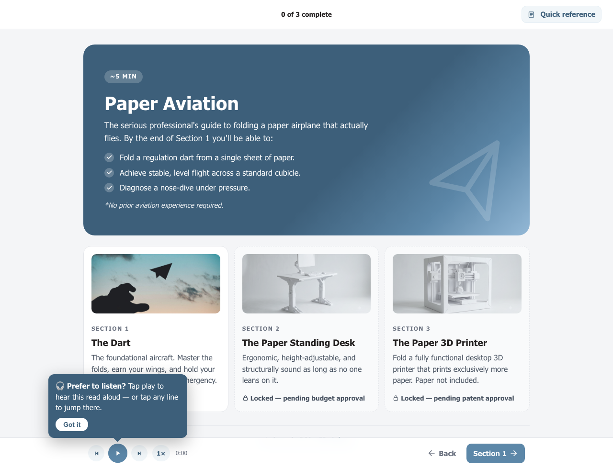

# Paper Aviation: a code-built e-learning demo

A small, deadpan professional certification in folding a paper airplane. It's a working demo of
**e-learning made in plain code instead of an authoring tool**, with narration generated by an LLM
workflow (Claude in the editor) calling the **ElevenLabs** API.

**▶ Live demo:** https://mikestein2016.github.io/claude-elevenlabs-elearning/



It's a joke on the surface. Section 1 is The Dart; Sections 2 and 3 (a paper standing desk and a paper 3D
printer) stay locked, pending budget and patent approval respectively. Underneath, it's an accessible
learning module you can fork and reuse.

## What it shows off

- **Sentence-synced narration.** One MP3 per card; each sentence highlights as it's read. Tap or
  keyboard-focus any line to jump straight to it (the audio *and* a companion video seek with it).
- **Voiceover over video.** Card 3 plays a muted demo clip in sync with the narration, so play, pause, and
  seek all stay locked together.
- **Gated progression that opens, not blocks.** You can't advance past the video until it's played, or
  finish until you pass the knowledge check, but a blocked "next" points you at what's needed (scrolls and
  rings it) instead of dead-ending.
- **A branching knowledge check** with spoken feedback per answer, shuffled options, and unlimited retries.
- **Keyboard and touch, first-class.** Arrow keys page the deck (and step the narration while it plays),
  Space plays/pauses, S changes speed; swipe left/right on touch devices. A section menu and search live in
  the top bar, both fully keyboard-operable.
- **Accessibility baked in.** WCAG 2.1 AA: semantic headings, focus-visible controls, a keyboard-operable
  transcript, an injected screen-reader orientation block, a polite live region for card changes,
  reduced-motion support, color-independent correctness cues, and a transcript that doubles as the video's
  text alternative.
- **Reads well on a phone.** Progress dots collapse to a slim bar on narrow screens, the title shortens,
  and a "more below" cue appears when a card runs past the fold.
- **No framework, no build step.** Vanilla HTML/CSS/JS. Serve the folder and it runs.

## Run it locally

The narration loads timing data with `fetch()`, so serve over HTTP (opening `index.html` from `file://`
won't load the audio timings). Any static server works:

```bash
python3 -m http.server 8000
# then open http://localhost:8000
```

## Regenerate the narration (optional)

The audio (`.mp3`) and timings (`.timing.json`) are committed, so the demo runs as-is with **no API key**.
You only need a key to re-voice it.

1. `cp .env.example .env` and add your ElevenLabs API key.
2. Edit the script in the manifests under `audio/` (the on-screen text **must** match the manifest text).
3. Regenerate:

```bash
python3 audio/generate.py --manifest audio/narration-section1.json                              # all cards
python3 audio/generate.py --manifest audio/narration-section1.json --cards s1-card03 --force    # one card
python3 audio/generate.py --manifest audio/narration-section1-fb.json --flat                    # feedback clips
```

It's seed-locked, so regenerating unchanged cards is a no-op.

## Project structure

```
index.html          Home / hero (narrated, container mode)
section1.html       The lesson, a 4-card deck (why -> fold steps -> video -> knowledge check)
complete.html       Certification / closer (narrated)
shared.js           Engine: top/bottom nav + gating, progress, lightbox
narration.js        Listen-along audio: highlighting, seek, companion video, feedback clips
theme.css           All styling + design tokens
assets/             Images, fold-step SVGs, the demo video, fold-diagrams.drawio (editable source)
audio/
  generate.py       ElevenLabs "with-timestamps" -> per-card MP3 + sentence timings
  narration-*.json  Narration manifests (the script)
  clips/            Generated MP3s + timing JSON
```

## Extending it (for humans and AI agents)

The engine's APIs, the narration model, and step-by-step "how to add X" recipes are in
**[AGENTS.md](AGENTS.md)**, written so Claude, Cursor, or any coding agent can pick up the codebase and
extend it safely. Start there before adding cards, sections, or audio.

## Credits & licensing

- Code: MIT (see [LICENSE](LICENSE)).
- Images generated with Google Gemini.
- Voice generated with [ElevenLabs](https://try.elevenlabs.io/voice-cloning-11-labs) (the "Chris, Down to Earth" voice).
- Demo video: CC0 from Pexels.
- Fold-step diagrams: original, made in draw.io (`assets/fold-diagrams.drawio`).

Built by [ID Atlas](https://www.idatlas.org).
